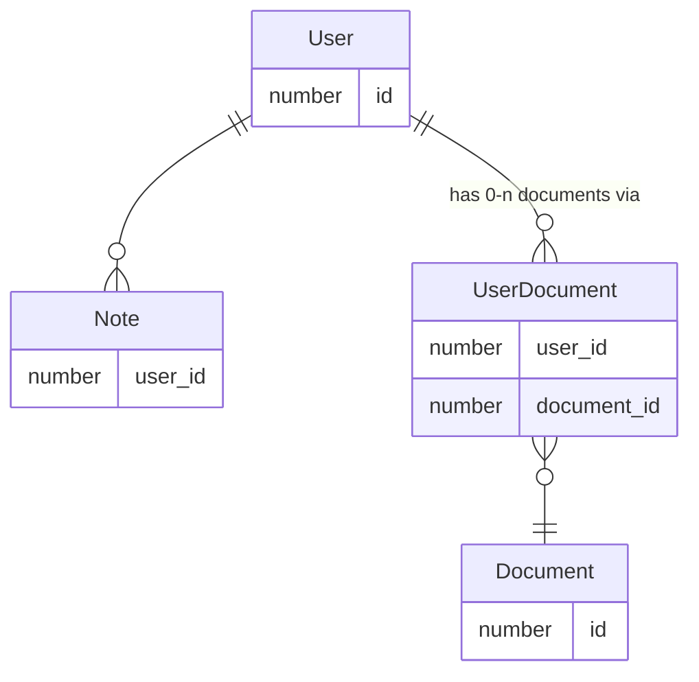

# Description

This is a basic FastAPI web app example with SQL Alchemy ORM and Alembic migration management system.

# Usage

## Dependencies installation

Go to the project folder and run `poetry install`.

## Code checks

Ruff and Black tools are used. Run `make checks` to autoformat and lint the code.

## Running the app

### DB

Run `make db-up` to spin up a Postgres docker image.

### DB migrations

Apply DB migrations by running `poetry run alembic upgrade head`

### API

Run `make run` to start the API.

### Tests

Run `make test-db-up` to spin up the test DB, then run `make test`

# ERD

# Useful documentation

[SQL Alchemy documentation](https://docs.sqlalchemy.org/en/20/)

[Alembic how-to](https://youtu.be/nt5sSr1A_qw?si=40O8oWLUX8kG7hay)

[Related objects documentation](https://docs.sqlalchemy.org/en/20/tutorial/orm_related_objects.html)

[Calculated columns](https://docs.sqlalchemy.org/en/20/orm/mapped_sql_expr.html#using-column-property)
